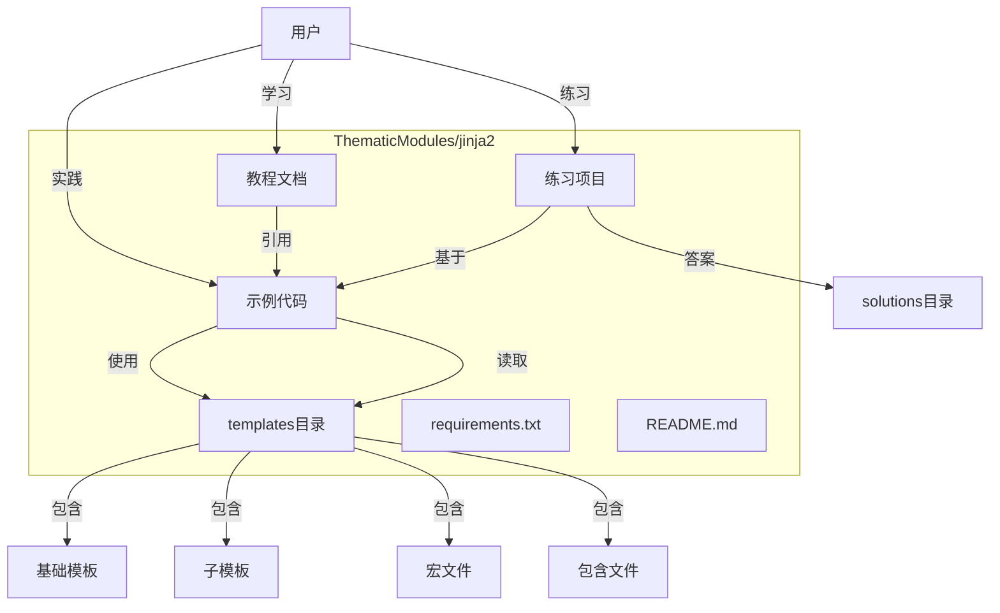
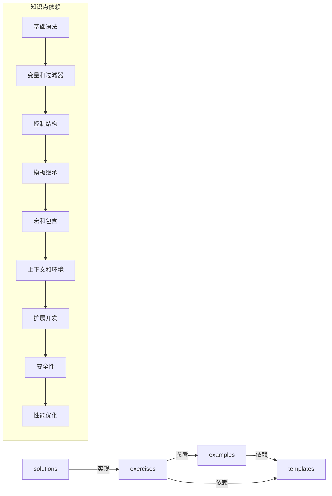
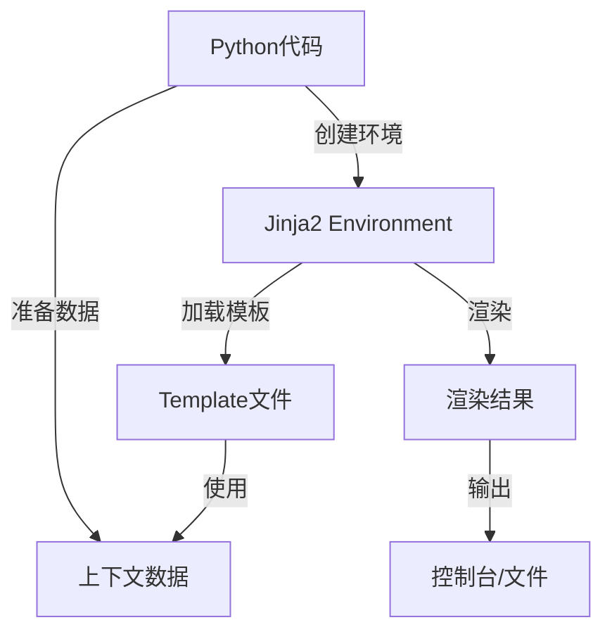

# DESIGN_JINJA2_LEARNING

## 整体架构图

## 分层设计和核心组件

### 1. 文档层
- **功能**：提供Jinja2知识点的详细说明和学习路径
- **文件位置**：ThematicModules/jinja2/docs/
- **核心组件**：按知识点分类的Markdown文档
- **设计原则**：内容全面、结构清晰、易于理解

### 2. 示例层
- **功能**：提供可执行的代码示例，展示Jinja2的实际使用方法
- **文件位置**：ThematicModules/jinja2/examples/
- **核心组件**：各知识点对应的Python示例文件
- **设计原则**：代码简洁、注释清晰、可独立运行

### 3. 模板层
- **功能**：提供示例代码所需的Jinja2模板文件
- **文件位置**：ThematicModules/jinja2/templates/
- **核心组件**：基础模板、子模板、宏文件、包含文件
- **设计原则**：结构合理、复用性高、演示核心功能

### 4. 练习层
- **功能**：提供实践练习，巩固学习成果
- **文件位置**：ThematicModules/jinja2/exercises/
- **核心组件**：练习文档和参考答案
- **设计原则**：难度递进、贴合实际应用场景

## 模块依赖关系图

## 接口契约定义

### 1. 示例代码接口
- **输入**：无特定输入，可直接运行
- **输出**：打印渲染结果到控制台或生成文件
- **调用方式**：`python filename.py`

### 2. 模板文件接口
- **输入**：上下文数据（由示例代码提供）
- **输出**：渲染后的HTML/文本内容
- **使用方式**：在示例代码中通过Jinja2环境加载和渲染

## 数据流向图

## 异常处理策略

### 1. 错误类型
- 模板语法错误：在加载模板时捕获
- 变量未定义错误：通过默认值或严格模式控制
- 文件不存在错误：在加载模板前检查文件路径
- 渲染错误：在渲染过程中捕获并提供详细信息

### 2. 处理方式
- 在示例代码中使用try-except捕获关键异常
- 提供清晰的错误信息和解决方案建议
- 在文档中说明常见错误及处理方法

## 设计原则

### 1. 严格按照任务范围
- 专注于Jinja2核心知识点的学习
- 避免引入不相关的技术和概念

### 2. 与现有系统架构一致
- 遵循PyKiTS项目的模块化设计原则
- 保持代码风格和文档格式的一致性

### 3. 复用现有组件和模式
- 复用Jinja2内置功能和最佳实践
- 避免重复造轮子

## 质量门控
- 架构图清晰准确地反映了系统结构
- 接口定义完整，无歧义
- 与现有系统无冲突
- 设计方案具有可行性和可扩展性
- 覆盖了所有需求点