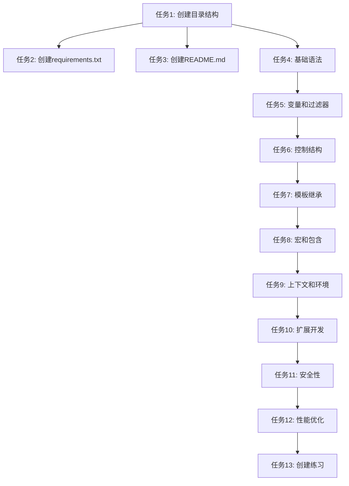

# TASK_JINJA2_LEARNING

## 子任务拆分

### 1. 任务1: 创建基础目录结构

- **输入契约**：
  - 现有空目录：ThematicModules/jinja2

- **输出契约**：
  - 完整的目录结构（docs, examples, templates, exercises, templates/includes, templates/macros, exercises/solutions）

- **实现约束**：
  - 严格按照DESIGN文档中的目录结构创建
  - 使用标准的文件系统操作

- **依赖关系**：
  - 无前置任务
  - 所有后续任务的基础

### 2. 任务2: 创建requirements.txt文件

- **输入契约**：
  - 目录结构已创建
  - Jinja2为主要依赖

- **输出契约**：
  - 包含Jinja2依赖的requirements.txt文件

- **实现约束**：
  - 指定Jinja2的版本
  - 格式符合pip要求

- **依赖关系**：
  - 前置任务：任务1
  - 无后置依赖

### 3. 任务3: 创建README.md文件

- **输入契约**：
  - 目录结构已创建

- **输出契约**：
  - 包含项目说明、使用方法、学习路径的README.md文件

- **实现约束**：
  - Markdown格式
  - 内容清晰、结构合理

- **依赖关系**：
  - 前置任务：任务1
  - 无后置依赖

### 4. 任务4: 创建基础语法教程和示例

- **输入契约**：
  - docs目录已创建
  - examples目录已创建
  - templates目录已创建

- **输出契约**：
  - docs/01_basic_syntax.md：基础语法教程
  - examples/basic_usage.py：基础用法示例
  - templates/basic_example.html：基础模板示例

- **实现约束**：
  - 覆盖Jinja2基础语法（变量、表达式、注释等）
  - 示例代码可独立运行

- **依赖关系**：
  - 前置任务：任务1
  - 后置任务：任务5

### 5. 任务5: 创建变量和过滤器教程和示例

- **输入契约**：
  - docs目录已创建
  - examples目录已创建
  - templates目录已创建

- **输出契约**：
  - docs/02_variables_and_filters.md：变量和过滤器教程
  - examples/variables_demo.py：变量和过滤器示例
  - templates/filters_example.html：过滤器示例模板

- **实现约束**：
  - 覆盖Jinja2内置变量类型和常用过滤器
  - 示例代码可独立运行

- **依赖关系**：
  - 前置任务：任务4
  - 后置任务：任务6

### 6. 任务6: 创建控制结构教程和示例

- **输入契约**：
  - docs目录已创建
  - examples目录已创建
  - templates目录已创建

- **输出契约**：
  - docs/03_control_structures.md：控制结构教程
  - examples/control_structures.py：控制结构示例
  - templates/control_example.html：控制结构示例模板

- **实现约束**：
  - 覆盖条件判断、循环等控制结构
  - 示例代码可独立运行

- **依赖关系**：
  - 前置任务：任务5
  - 后置任务：任务7

### 7. 任务7: 创建模板继承教程和示例

- **输入契约**：
  - docs目录已创建
  - examples目录已创建
  - templates目录已创建

- **输出契约**：
  - docs/04_template_inheritance.md：模板继承教程
  - examples/template_inheritance.py：模板继承示例
  - templates/base.html：基础模板
  - templates/child.html：子模板

- **实现约束**：
  - 覆盖模板继承、块、超块等概念
  - 示例代码可独立运行

- **依赖关系**：
  - 前置任务：任务6
  - 后置任务：任务8

### 8. 任务8: 创建宏和包含教程和示例

- **输入契约**：
  - docs目录已创建
  - examples目录已创建
  - templates目录已创建
  - templates/macros目录已创建
  - templates/includes目录已创建

- **输出契约**：
  - docs/05_macros_and_includes.md：宏和包含教程
  - examples/macros_demo.py：宏和包含示例
  - templates/macros/utils.html：宏定义文件
  - templates/includes/header.html：包含文件

- **实现约束**：
  - 覆盖宏定义、调用、包含等功能
  - 示例代码可独立运行

- **依赖关系**：
  - 前置任务：任务7
  - 后置任务：任务9

### 9. 任务9: 创建上下文和环境配置教程和示例

- **输入契约**：
  - docs目录已创建
  - examples目录已创建

- **输出契约**：
  - docs/06_context_and_environment.md：上下文和环境配置教程
  - examples/context_environment.py：上下文和环境配置示例

- **实现约束**：
  - 覆盖Jinja2环境配置、上下文传递等功能
  - 示例代码可独立运行

- **依赖关系**：
  - 前置任务：任务8
  - 后置任务：任务10

### 10. 任务10: 创建扩展开发教程和示例

- **输入契约**：
  - docs目录已创建
  - examples目录已创建
  - templates目录已创建

- **输出契约**：
  - docs/07_extensions.md：扩展开发教程
  - examples/extension_example.py：扩展示例
  - templates/extension_example.html：扩展示例模板

- **实现约束**：
  - 覆盖自定义过滤器、测试、标签等扩展开发
  - 示例代码可独立运行

- **依赖关系**：
  - 前置任务：任务9
  - 后置任务：任务11

### 11. 任务11: 创建安全性教程

- **输入契约**：
  - docs目录已创建

- **输出契约**：
  - docs/08_security.md：安全性教程

- **实现约束**：
  - 覆盖XSS防护、沙箱模式等安全特性
  - 提供安全最佳实践

- **依赖关系**：
  - 前置任务：任务10
  - 后置任务：任务12

### 12. 任务12: 创建性能优化教程

- **输入契约**：
  - docs目录已创建

- **输出契约**：
  - docs/09_performance.md：性能优化教程

- **实现约束**：
  - 覆盖模板缓存、预编译等性能优化技术
  - 提供性能最佳实践

- **依赖关系**：
  - 前置任务：任务11
  - 无后置任务

### 13. 任务13: 创建练习项目

- **输入契约**：
  - exercises目录已创建
  - solutions目录已创建

- **输出契约**：
  - exercises/exercise_01.md：练习1
  - exercises/exercise_02.md：练习2
  - exercises/solutions/exercise_01_solution.py：练习1答案
  - exercises/solutions/exercise_02_solution.py：练习2答案

- **实现约束**：
  - 练习内容覆盖核心知识点
  - 答案正确、代码规范

- **依赖关系**：
  - 前置任务：任务12
  - 无后置任务

## 任务依赖图

## 拆分原则
- 每个任务专注于一个具体的知识点或功能
- 任务之间保持清晰的依赖关系
- 每个任务都有明确的输入输出和验收标准
- 确保任务可以独立验证和测试
- 复杂度适中，便于执行和管理

## 质量门控
- 任务覆盖了所有需求点
- 依赖关系清晰，无循环依赖
- 每个任务都有明确的验收标准
- 任务拆分合理，复杂度适中
- 与设计文档保持一致